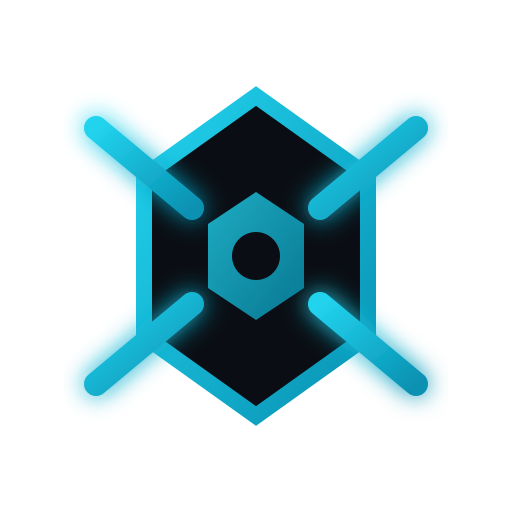

<h1 align="center">
  <br>
  
  <br>
  Sixarms
  <br>
</h1>

<h4 align="center">AI-Powered Development Progress Tracker</h4>

<p align="center">
  <a href="#features">Features</a> •
  <a href="#installation">Installation</a> •
  <a href="#usage">Usage</a> •
  <a href="#roadmap">Roadmap</a> •
  <a href="#contributing">Contributing</a>
</p>

<p align="center">
  
  
  
  
</p>

---

A native macOS desktop application that helps developers track their work progress through AI-powered conversations and automatic git activity scanning.

> **智能開發進度追蹤助手** - 透過 AI 對話和 Git 活動自動掃描，幫助開發者追蹤工作進度。

## Features

- **AI Chat** - Chat with Grok AI to log your daily work; AI automatically categorizes and organizes your progress
- **Inbox** - AI-generated questions to help you reflect on your work and fill in the gaps
- **Dashboard** - Activity heatmap, monthly trends, and work distribution statistics
- **Project Management** - Track multiple projects with status and activity monitoring
- **TODO Tracking** - Simple task management integrated with your projects
- **Git Integration** - Automatic scanning of git commits to track your development activity
- **Secure Storage** - API keys stored in macOS Keychain, not plain text

## Tech Stack

| Layer | Technologies |
|-------|-------------|
| **Frontend** | React 18, TypeScript, Tailwind CSS, Zustand, Framer Motion |
| **Backend** | Rust, Tauri v2, SQLite, reqwest |
| **AI** | Grok API (x.ai) |
| **Security** | macOS Keychain (security-framework) |

## Installation

### Prerequisites

- **Node.js** 18+ and npm
- **Rust** 1.77+ with Cargo
- **Xcode Command Line Tools** (macOS)
- **Grok API Key** from [x.ai](https://x.ai)

### From Source

```bash
# Clone the repository
git clone https://github.com/888wing/sixarms.git
cd sixarms

# Install dependencies
npm install

# Run in development mode
npm run tauri dev

# Build for production
npm run tauri build
```

### Download Release

Check the [Releases](https://github.com/888wing/sixarms/releases) page for pre-built macOS binaries.

## Usage

1. **Launch the app** and navigate to **Settings**
2. **Enter your Grok API Key** (stored securely in macOS Keychain)
3. **Add your projects** by specifying name and local path
4. **Start chatting** with the AI to log your work!

The app will automatically:
- Scan your git commits on configured intervals
- Categorize your work (feature, bugfix, refactor, etc.)
- Generate activity statistics and heatmaps
- Create reflection questions to help you document your progress

## Project Structure

```
sixarms/
├── src/                    # React frontend
│   ├── pages/              # Page components (Home, Dashboard, Chat, Inbox, Settings)
│   ├── stores/             # Zustand state stores
│   ├── components/         # Reusable UI components
│   └── lib/                # API bindings and types
├── src-tauri/              # Rust backend
│   └── src/
│       ├── db.rs           # SQLite database operations
│       ├── commands.rs     # Tauri IPC command handlers
│       ├── grok.rs         # Grok AI API client
│       ├── scanner.rs      # Git diff scanner
│       ├── scheduler.rs    # Periodic background scanning
│       └── keychain.rs     # macOS Keychain integration
└── docs/                   # Documentation
```

## Roadmap

### Current (v0.1)
- [x] Core desktop app
- [x] Git activity scanning
- [x] AI chat and classification
- [x] Activity dashboard
- [x] Local SQLite storage

### Coming Soon (v0.2)
- [ ] Cloud sync (Pro feature)
- [ ] Weekly/monthly reports
- [ ] Enhanced AI insights
- [ ] Productivity analytics

### Future
- [ ] Team collaboration
- [ ] Windows/Linux support
- [ ] Multiple AI providers

## Known Limitations

- **macOS only** - Keychain integration requires macOS
- **Grok API only** - Currently only supports Grok AI
- **No tests yet** - Unit and integration tests are planned

## Contributing

Contributions are welcome! Please read our [Contributing Guide](CONTRIBUTING.md) before submitting a Pull Request.

See [CODE_OF_CONDUCT.md](CODE_OF_CONDUCT.md) for community guidelines.

## License

[MIT](LICENSE) © 2025 Sixarms

---

<p align="center">
  Built with ❤️ using <a href="https://tauri.app">Tauri</a>, <a href="https://react.dev">React</a>, and <a href="https://rust-lang.org">Rust</a>
</p>
